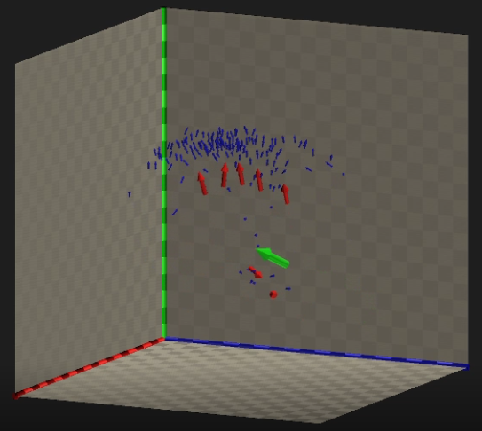
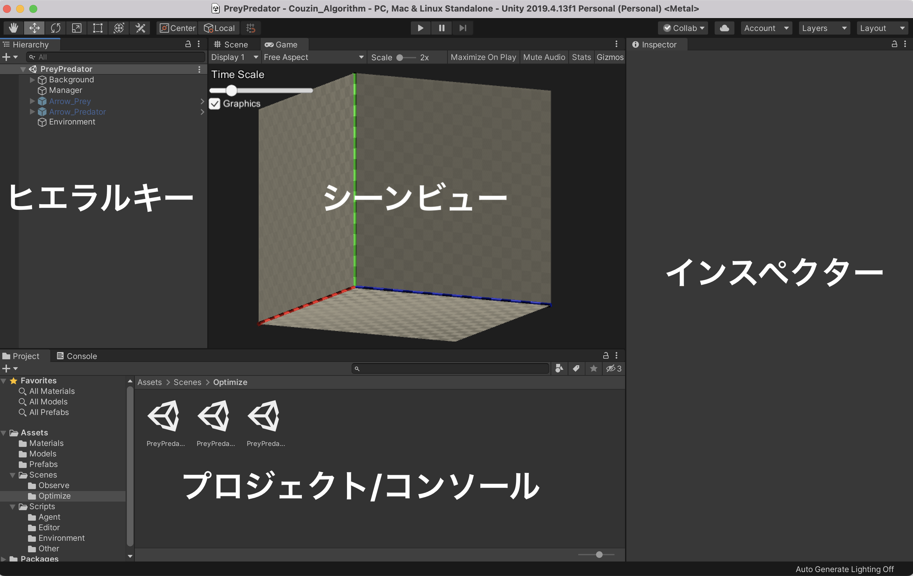
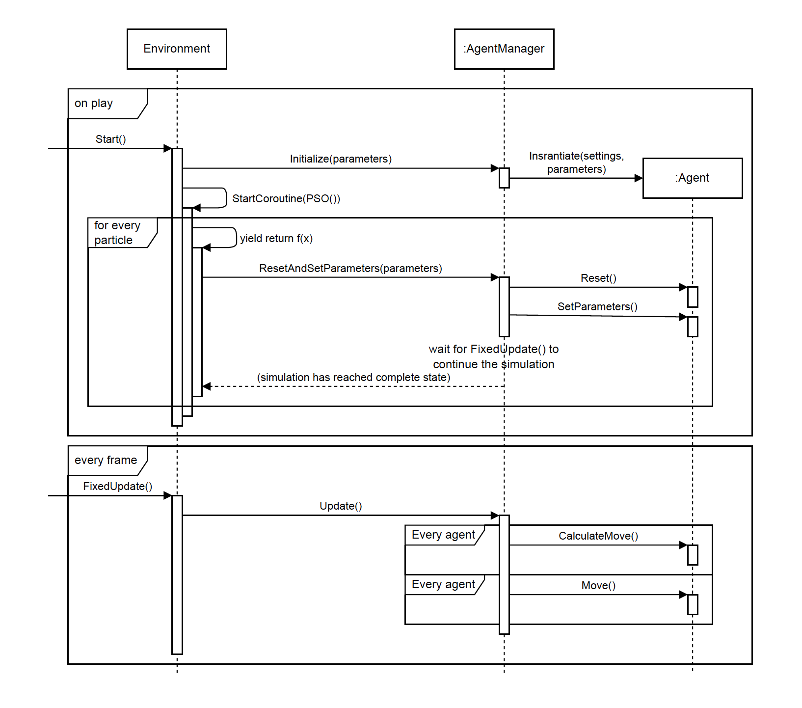
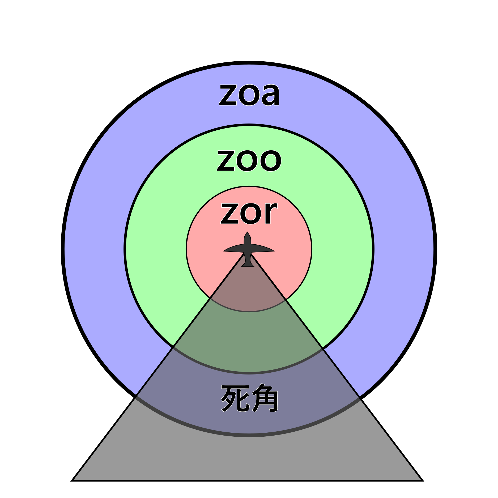

# Couzin's Algorithm

## 概要
boidのアルゴリズムのように魚や鳥などの群れ行動をシミュレーションします．
Couzinのアルゴリズムはboidよりかは少しばかり複雑なアルゴリズムです．

パラメータを変化させることで集団のふるまいが大きく変化します．

複数種族の相互作用を考えることで捕食・逃避行動をシミュレーションできます．

また, 最適化手法を用いてCouzinアルゴリズムのパラメータの最適化を試すことができます.

Unityのバージョンは，`2019.4.13f1`で作成しました．それ以外のバージョンでは動作確認していません．

目次
- [Couzin's Algorithm](#couzins-algorithm)
  - [概要](#概要)
  - [Unityの基本的な説明](#unityの基本的な説明)
      - [操作画面](#操作画面)
  - [シーンの説明](#シーンの説明)
      - [Observe](#observe)
      - [Optimize](#optimize)
  - [スクリプトの説明](#スクリプトの説明)
    - [シーケンス](#シーケンス)
    - [最適化手法の導入](#最適化手法の導入)
  - [アルゴリズムの説明](#アルゴリズムの説明)
    - [周囲に自らと同種族のみが存在する場合](#周囲に自らと同種族のみが存在する場合)
    - [周囲に他の種族の個体が存在する場合](#周囲に他の種族の個体が存在する場合)
  - [参考文献](#参考文献)

## Unityの基本的な説明
#### 操作画面
Unityを開くと以下のような画面になります.

プロジェクトウィンドウで`Assets/Scenes/`の中からシーンを選ぶことでシーンを選択することができます. その後, 画面上部の再生ボタンをクリックすることでシミュレーションを開始することができます. 各シーンに配置されているオブジェクト(魚や壁, またシミュレーションを統括しているスクリプトなど)はヒエラルキーに表示され, 選択することでインスペクターで編集することができます.

例えばCouzinのパラメータは, `Assets/Scenes/Observe/Playground`などのシーンをプロジェクトウィンドウでダブルクリックして開き, Arrowの名が入ったオブジェクトをヒエラルキーで選択し, インスペクターに表示されたCouzin Agentコンポーネントを編集することで変更することができます.

## シーンの説明
ObserveとOptimizeの2種類のシーンがあります. 

#### Observe
ObserveではCouzinのパラメータを手動で変えて魚の行動を観察することができます. Observeには以下の5つのシーンが用意されています．
好きなシーンを開いて，Unity Editorの画面上部中央のPlayボタンを押せば動かすことができます．
再生中にはGame画面の左上に表示されるTime Scaleのスライダーでプログラムの実行速度を調整できます．

- `Assets/Scenes/Observe/SingleGroup.unity`
1種族のみがランダムに配置されます．
パラメータを変化させることで集団のふるまいが変化することが確認できます．

- `Assets/Scenes/Observe/PreyPredator.unity`
捕食者と被捕食者がランダムに配置されます．
捕食・逃避行動のシミュレーションができます．

- `Assets/Scenes/Observe/PreyPredator2.unity`
捕食者と被捕食者が向かい合うようにに配置されます．
パラメータによって散開的拡散や湧出効果のような逃避行動が見られます．

- `Assets/Scenes/Observe/PreyPredator3.unity`
捕食者・被捕食者に加え頂点捕食者が配置されます．
（このプログラムでは頂点捕食者は底辺被捕食者を捕食しません．）

- `Assets/Scenes/Observe/PlayGround.unity`
エージェントや障害物を自由に配置して遊ぶことができます．
デフォルトでは捕食関係にない3種族のエージェントが配置されます．

#### Optimize
Optimizeでは, Couzinのアルゴリズムを焼きなまし法やPSOなどを用いて最適化することができます. シーンの初期設定はObserveと同じですが, ヒエラルキーウィンドウでEnvironmentコンポーネントを選択するとインスペクターで最適化手法を選択することができます.

## スクリプトの説明
### シーケンス
このプログラムは大まかに以下のような流れで動作しています(図はPSOによる最適化の例です). 上部に記載されているon playは最初に再生ボタンを押した時に実行されます. 一方, 下部に記載されているevery frameは毎フレーム実行されます.

### 最適化手法の導入
`Assets/Scenes/Optimize`以下に配置されているシーンの中でEnvironmentオブジェクトの実行したいコンポーネントだけにチェックマークを付けることで最適化手法を選ぶことができます. `Assets/Scripts/Environment/AnnealEnvironment.cs`には焼きなまし法, `Assets/Scripts/Environment/PSOEnvironment.cs`にはParticle Swarm Optimizationが実装されています. 

各Environment.csはAgentManagerを操作することができるので, 好きな最適化手法を用いてパラメータの最適化を行うことができます. 実装の際は`Assets/Scripts/Environment/MyEnvironment.cs`のコメントに詳細が書いてあるので参照してください.

## アルゴリズムの説明
Couzinのアルゴリズムでは，各個体が周囲の個体の位置・速度の情報をもとに次に移動する方向を決定します．
その基本原理は，個体間で適切な距離を保ちながら，かつ，他の個体から離れすぎないというものです．

詳しい説明は[参考文献](#参考文献)をご参照ください．

### 周囲に自らと同種族のみが存在する場合
自らの周囲を距離に応じて3種類の領域に分割します．（下図）

それぞれの領域の意味合いは以下の通りです．
- **Zone of repulsion (zor)** に存在する個体とは距離をとろうとします．
- **Zone of orientation (zoo)** に存在する個体と同じ方向に整列しようとします．
- **Zone of attraction (zoa)** に存在する個体に近づこうとします．

また，zor外の死角にいる個体は感知しません．

各個体の次に移動する方向は以下のルールで決定します．
- zorに別の個体が存在する場合，それらの個体から離れるようにします．これが最優先事項です．
- それ以外の場合，zooの個体とは向きを合わせるようにしながら，zoaの個体には近づくようにします．

それぞれの領域の広さを変化させると，最初の図のように異なった集団のふるまいが見られます．
（A: 群集，B: トーラス，C: 動的な併進，D: 高度な併進）

### 周囲に他の種族の個体が存在する場合
zorや索敵範囲内に他の種族の個体が存在する場合は，相手が獲物であればそれに近づくように，そうでなければ離れるように移動する．
それ以外の場合は，上の[周囲に自らと同種族のみが存在する場合](#周囲に自らと同種族のみが存在する場合)と同じです．

## 参考文献
- I. D. Couzin, J. Krause, R. James, G. D. Ruxton, and N. R. Franks, "Collective Memory and Spatial Sorting in Animal Groups," *Journal of Theoretical Biology*, vol. 218, no. 1, pp. 1-11, 2002.
- 伊庭斉志, *深層学習とメタヒューリスティクス ディープ・ニューラルエボリューション*, オーム社, 2019.
